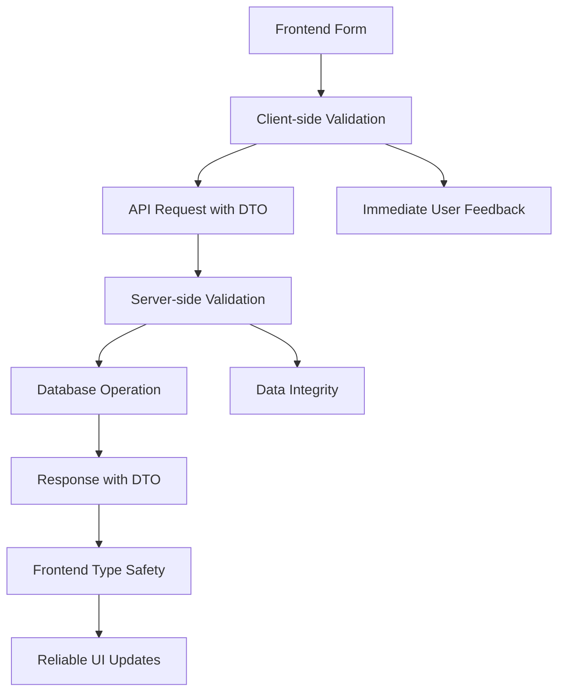

# 📋 **DTO (Data Transfer Object) Documentation**

## 🎯 **What are DTOs and Why Do We Need Them?**

DTOs (Data Transfer Objects) are structured schemas that define the shape and validation rules for data moving between different layers of our application. In BrandVoice.ai, we use **Zod schemas** to create type-safe DTOs.

## 🏗️ **Technical Benefits**

### **1. Type Safety**
```typescript
// ❌ Without DTOs - Runtime errors possible
const createMission = (data: any) => {
  // What if data.title is undefined? What if data.platform is invalid?
  return api.post('/missions', data)
}

// ✅ With DTOs - Compile-time safety
const createMission = (data: CreateMission) => {
  // TypeScript knows exactly what fields are required and their types
  return api.post('/missions', data)
}
```

### **2. Runtime Validation**
```typescript
// API endpoint with validation
export async function POST(req: Request) {
  const body = await req.json()
  
  // Validates and throws error if invalid
  const validatedData = CreateMissionSchema.parse(body)
  
  // Now we know the data is safe to use
  const mission = await db.insert(missions).values(validatedData)
}
```

### **3. API Documentation**
DTOs serve as living documentation - developers can see exactly what each API expects without reading implementation code.

### **4. Consistent Data Structure**
All parts of the application use the same data structure, preventing inconsistencies.

## 💼 **Business Benefits**

### **1. Reduced Bugs**
- **Input validation** prevents malformed data from entering the system
- **Type safety** catches errors during development, not in production
- **Consistent data** reduces integration issues between frontend and backend

### **2. Faster Development**
- **Auto-completion** in IDEs speeds up development
- **Clear contracts** between frontend and backend reduce communication overhead
- **Reusable schemas** eliminate duplicate validation logic

### **3. Better User Experience**
- **Client-side validation** provides immediate feedback
- **Consistent error messages** improve user understanding
- **Data integrity** ensures reliable application behavior

### **4. Maintainability**
- **Single source of truth** for data structures
- **Easy refactoring** - change schema once, update everywhere
- **Clear separation** between data validation and business logic

## 📊 **Our DTO Categories**

### **🔧 Core Entity DTOs**

#### **Mission DTOs**
```typescript
// Create a new mission
CreateMissionSchema = {
  title: string (1-200 chars)
  platform: "youtube" | "instagram" | "tiktok" | "upload"
  sourceUrl: valid URL
  sourceExternalId?: string
  description?: string (max 1000 chars)
  pinned?: boolean
}

// Update existing mission
UpdateMissionSchema = CreateMissionSchema.partial() + { id: string }
```

**Business Value**: Ensures all missions have required data and prevents invalid URLs from being stored.

#### **Mission Outcome DTOs**
```typescript
CreateMissionOutcomeSchema = {
  missionId: string
  type: "threads" | "linkedin_post" | "instagram_carousel" | "video_script"
  title?: string (max 200 chars)
  content: string (1-10000 chars)
  metadata?: any (JSONB for flexible data)
  status: "draft" | "final" | "published" | "archived"
}
```

**Business Value**: Guarantees content quality (minimum length) and proper categorization for analytics.

#### **Voice Profile DTOs**
```typescript
CreateVoiceProfileSchema = {
  name: string (1-100 chars)
  tone: string (1-500 chars)
  audience: string (1-500 chars)
  keywords?: string[]
  vocabulary?: string[]
  cta?: string (max 500 chars)
  hashtags?: string[]
  style?: string (max 500 chars)
}
```

**Business Value**: Ensures voice profiles are complete and within reasonable limits for AI processing.

### **🚀 Process DTOs**

#### **Content Generation**
```typescript
ProcessPayloadSchema = {
  url?: valid URL
  caption?: string
  transcript?: string
  voice?: BrandVoice object
  referenceItems?: ContextRef[]
  pastMissions?: PastMission[]
  missionId?: string
}
```

**Business Value**: Validates input sources and ensures AI has proper context for generation.

#### **API Response DTOs**
```typescript
ApiResponseSchema = {
  success: boolean
  data?: any
  error?: string
  message?: string
}

PaginatedResponseSchema = ApiResponseSchema + {
  data: array
  pagination: {
    page: number
    limit: number
    total: number
    totalPages: number
  }
}
```

**Business Value**: Consistent API responses improve frontend reliability and error handling.

### **📱 Onboarding DTOs**

#### **Onboarding Progress**
```typescript
UpdateOnboardingProgressSchema = {
  currentStep?: 1 | 2 | 3
  platformConnected?: "youtube" | "instagram" | "tiktok" | "upload"
  voiceProfileId?: string
  isCompleted?: boolean
}
```

**Business Value**: Ensures onboarding flow integrity and prevents users from skipping required steps.

## 🔄 **Data Flow with DTOs**



## 🛡️ **Security Benefits**

### **1. Input Sanitization**
- **Length limits** prevent buffer overflow attacks
- **Type validation** prevents injection attacks
- **Required fields** ensure data completeness

### **2. Data Consistency**
- **Enum validation** prevents invalid states
- **URL validation** prevents malicious links
- **JSONB validation** ensures structured metadata

## 📈 **Performance Benefits**

### **1. Early Validation**
- **Client-side validation** reduces server requests
- **Type checking** catches errors before runtime
- **Structured data** enables better database indexing

### **2. Optimized Queries**
- **Consistent schemas** enable query optimization
- **Proper typing** allows for better caching strategies
- **Validation caching** reduces repeated validation overhead

## 🎯 **Best Practices Implemented**

### **1. Schema Composition**
```typescript
// Base schema
const BaseEntitySchema = z.object({
  id: z.string().min(1),
  createdAt: z.string().datetime(),
  updatedAt: z.string().datetime(),
})

// Extend for specific entities
const MissionSchema = BaseEntitySchema.extend({
  title: z.string().min(1),
  platform: z.enum(["youtube", "instagram", "tiktok", "upload"]),
})
```

### **2. Partial Updates**
```typescript
// Create schema
const CreateVoiceProfileSchema = z.object({...})

// Update schema (all fields optional except ID)
const UpdateVoiceProfileSchema = CreateVoiceProfileSchema.partial().extend({
  id: z.string().min(1),
})
```

### **3. Flexible Metadata**
```typescript
// JSONB field for flexible data
metadata: z.any().optional()
```

## 🚀 **Future Enhancements**

### **1. Advanced Validation**
- **Custom validators** for business rules
- **Cross-field validation** (e.g., end date > start date)
- **Async validation** (e.g., URL accessibility)

### **2. Schema Evolution**
- **Versioning** for API compatibility
- **Migration helpers** for schema changes
- **Backward compatibility** strategies

### **3. Performance Optimization**
- **Lazy validation** for large datasets
- **Validation caching** for repeated requests
- **Streaming validation** for real-time data

## 📋 **Summary**

Our DTO system provides:

✅ **Type Safety** - Catch errors at compile time  
✅ **Runtime Validation** - Ensure data integrity  
✅ **API Documentation** - Self-documenting code  
✅ **Consistency** - Uniform data structures  
✅ **Security** - Input sanitization and validation  
✅ **Performance** - Optimized data handling  
✅ **Maintainability** - Single source of truth  
✅ **Developer Experience** - Better tooling and debugging  

This comprehensive DTO system makes BrandVoice.ai more robust, maintainable, and user-friendly while reducing development time and bugs.
